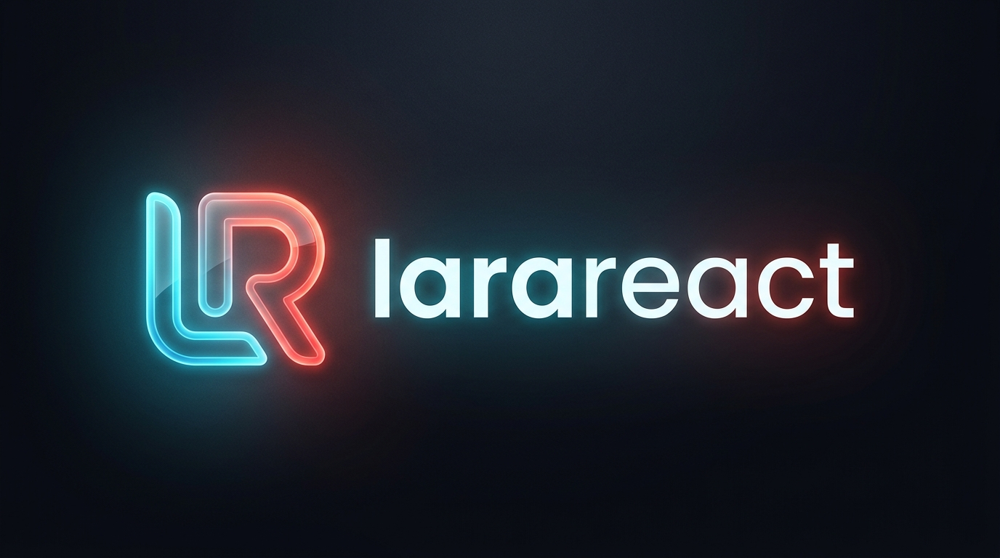

# LaraReact - Admin Panel Full Stack



Sistema de administración full-stack construido con **Laravel 13 + React 19 + shadcn/ui**, moderno, escalable y listo para producción.

## Tecnologías Principales

### Backend
- **PHP 8.3+** - Versión mínima requerida
- **Laravel 13.17** - Framework PHP de última generación
- **InertiaJS 3.0** - Bridge entre Laravel y React sin APIs REST separadas
- **Laravel Fortify** - Autenticación de usuarios
- **Spatie Activitylog** - Registro de actividades en el sistema
- **MySQL/SQLite** - Bases de datos soportadas

### Frontend
- **React 19.2** - Última versión de React con compilador oficial
- **TypeScript 5.7** - Tipado estático para código robusto
- **shadcn/ui** - Componentes de UI accesibles y personalizables
- **TailwindCSS 4.0** - Framework de estilos utility-first
- **react-leaflet 5.0** - Integración de mapas interactivos Leaflet
- **Lucide React** - Iconos modernos y ligeros
- **Sonner** - Sistema de notificaciones toast
- **Vite 8.0** - Build tool ultrarrápido para desarrollo

## Instalación como Paquete (Uso Principal)

LaraReact está diseñado para ser instalado como dependencia en tus proyectos Laravel existentes o nuevos:

```bash
# En tu proyecto Laravel (nuevo o existente)
composer require theizerdev/larareact
```

Después de instalar el paquete, ejecuta el comando de instalación para publicar todos los assets:

```bash
php artisan larareact:install
```

Este comando publica automáticamente:
- Archivos de configuración
- Componentes React (shadcn/ui + componentes personalizados)
- Assets CSS y JavaScript
- Archivos de idioma para multilenguaje
- Migraciones del módulo de países

### Instalación Completa desde el Repositorio (Desarrollo)

Si quieres contribuir o modificar LaraReact, clona el repositorio completo:

```bash
# Clonar y configurar
git clone https://github.com/theizerdev/larareact.git
cd larareact
composer install
npm install
cp .env.example .env
php artisan key:generate
php artisan migrate --force
npm run dev

## Módulos del Sistema

### 🔐 Autenticación y Seguridad
- Login/Registro de usuarios
- Recuperación de contraseña
- Autenticación de dos factores (2FA)
- Passkeys webauthn
- Roles y permisos básicos
- Sesiones seguras

### 🎨 Panel de Administración
- Layout responsive con sidebar colapsable
- Tema claro/oscuro (modo oscuro por defecto)
- Cambiador de idioma (Español/Inglés)
- Barra de navegación superior con menú de usuario
- Dashboard con estadísticas básicas
- Páginas de configuración de perfil, seguridad y apariencia

### 🌍 Módulo de Gestión de Países (CRUD Completo)
- Listado paginado de países con datos ISO
- Creación y edición de países con formulario validado
- Vista en mapa interactivo con Leaflet
- Selección de coordenadas mediante clic en el mapa
- Estados activo/inactivo para cada país
- Filtros avanzados:
  - Buscador por nombre, código ISO2/ISO3
  - Filtro por estado (activo/inactivo)
  - Selector de registros por página (10/25/50/100)
- Búsqueda con debounce de 300ms para optimizar consultas
- Eliminación masiva de registros seleccionados
- Exportación de datos

### 🗺️ Características Técnicas Destacadas
- **SSR Seguro**: Mapas Leaflet cargados solo en cliente para evitar errores de window undefined
- **Lazy Loading**: Componentes pesados cargados bajo demanda
- **Paginación Reutilizable**: Componente genérico compatible con la paginación de Laravel
- **Multilenguaje Nativo**: Sistema de cambio de idioma con persistencia en sesión
- **Actividad Log**: Registro de todas las acciones realizadas en el sistema
- **Arquitectura Modular**: Componentes reutilizables y fácilmente extensibles
- **Código Tipado**: TypeScript en todo el frontend para mayor robustez

## Componentes Disponibles
- **UI Base**: Alert, Avatar, Badge, Button, Card, Checkbox, Dialog, Input, Label, Select, Table, Tabs, etc.
- **Negocio**: Pagination (reutilizable), FilterBar, Breadcrumbs, StatCard, DataTable
- **Mapas**: MapComponent (Leaflet), PaisesMap para visualización geográfica
- **Utilidades**: ConfirmDialogs, LanguageTabs, AppearanceToggle, Sonner notifications

## Scripts Disponibles
```bash
# Desarrollo
npm run dev          # Iniciar servidor de desarrollo Vite
composer run dev     # Iniciar servidor Laravel + Vite concurrently

# Build
npm run build        # Compilar para producción
npm run build:ssr    # Compilar con soporte SSR

# Calidad de Código
npm run lint         # Ejecutar ESLint con fix
npm run lint:check   # Verificar errores de lint
npm run format       # Formatear código con Prettier
npm run format:check # Verificar formato
npm run types:check  # Verificar tipos TypeScript
composer run lint    # Ejecutar Laravel Pint (PHP)
composer run test    # Ejecutar tests PHPUnit + linters
```

## Estructura de Archivos Clave
```
├── app/
│   ├── Http/
│   │   └── Controllers/Admin/PaisController.php  # Controlador de países
│   └── Models/Pais.php                           # Modelo de país con lógica de negocio
├── resources/
│   ├── js/
│   │   ├── Pages/Admin/Paises/                   # Páginas del módulo
│   │   │   ├── Index.tsx                         # Página principal
│   │   │   └── Partials/                         # Componentes parciales
│   │   └── components/pagination.tsx             # Componente de paginación genérico
│   └── lang/es/paises.php                        # Traducciones español
└── lang/en/paises.php                            # Traducciones inglés (pendiente)
```

## Requisitos del Sistema
- PHP 8.3+
- Laravel 13+
- Node.js 20+
- MySQL 8.0+ / PostgreSQL 13+
- Extensiones PHP: GD, cURL, JSON, MBstring, XML

## Licencia
MIT - El código es open-source y puedes usarlo libremente en proyectos personales y comerciales.

## Mantenimiento
Proyecto mantenido por theizerdev. Reporta issues en el repositorio de GitHub.