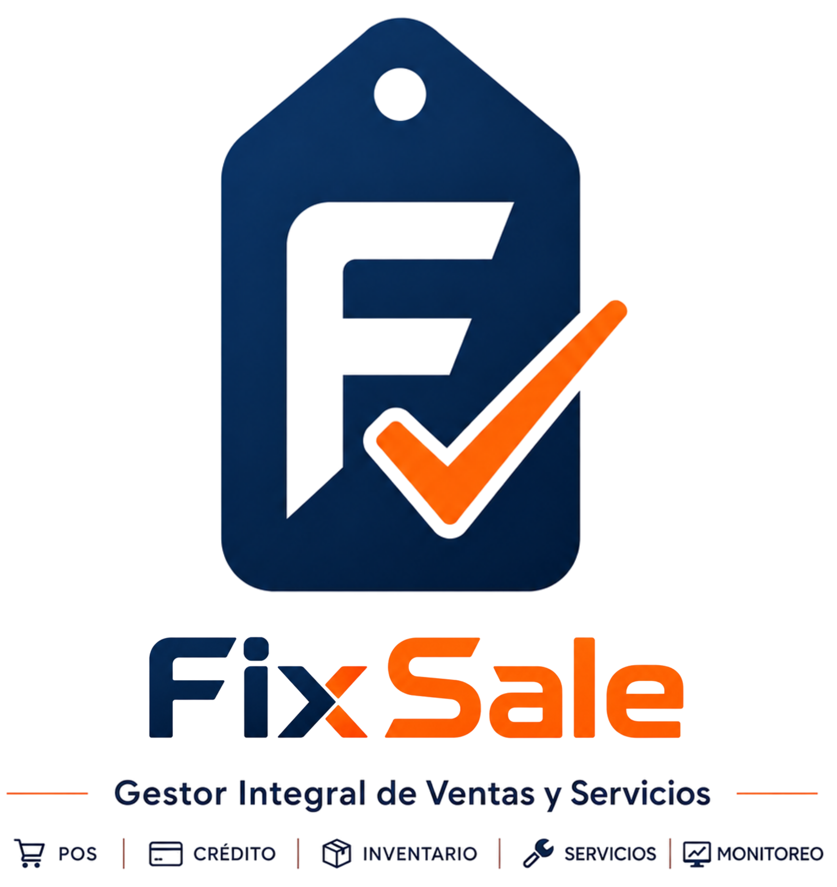

<p align="center">
  
</p>

<h1 align="center">FixSale — Gestor Integral de Ventas, POS, Inventario y ERP Multi-Tenant</h1>

<p align="center">
  <b>FixSale</b> es un ecosistema SaaS empresarial de alto rendimiento diseñado para la administración unificada de <b>Puntos de Venta (POS)</b>, <b>Gestión de Crédito Flexible</b>, <b>Control de Inventario y Kardex</b>, <b>Servicios Técnicos</b>, <b>Facturación de Compras</b> y <b>Monitoreo en Tiempo Real</b>, impulsado por una arquitectura multi-empresa y multi-sucursal avanzada.
</p>

---

## 🎨 Guía y Verificación de Assets de Logos (`public/image/logo`)

El proyecto cuenta con un conjunto estandarizado de isotipos y logotipos corporativos optimizados para diferentes casos de uso (modo claro, modo oscuro, favicons y branding):

| Archivo | Asset | Tipo | Uso Recomendado |
| :--- | :---: | :--- | :--- |
| [`public/image/logo/2.png`](file:///c:/laragon/www/fixsalePOS/public/image/logo/2.png) | Isotipo Cuadrado | **Isotipo / Icono** | Favicon del sistema, avatar predeterminado de empresa, loaders en miniatura y app icon. |
| [`public/image/logo/3.png`](file:///c:/laragon/www/fixsalePOS/public/image/logo/3.png) | Logo Vertical con Módulos | **Logo Oficial Completo** | Presentación principal, documentación de repositorio, carátulas y banners institucionales. |
| [`public/image/logo/4.png`](file:///c:/laragon/www/fixsalePOS/public/image/logo/4.png) | Logo Vertical con Eslogan | **Logo Vertical Corporativo** | Formatos verticales, banners promocionales y folletos. |
| [`public/image/logo/5.png`](file:///c:/laragon/www/fixsalePOS/public/image/logo/5.png) | Logo Horizontal con Eslogan | **Logo Horizontal Light Mode** | Navbar superior, landing page (`welcome.tsx`), pantallas de Login/Auth en fondos claros. |
| [`public/image/logo/6.png`](file:///c:/laragon/www/fixsalePOS/public/image/logo/6.png) | Logo Horizontal Simplificado | **Logo Horizontal Compacto** | Modales, headers compactos y tickets de venta. |
| [`public/image/logo/7.png`](file:///c:/laragon/www/fixsalePOS/public/image/logo/7.png) | Logo Horizontal Monocromático | **Logo Horizontal Dark Mode** | Interfaces con tema oscuro (Dark Mode), Auth Split layout en fondos oscuros. |

---

## 🌟 Descripción General del Sistema

**FixSale** es una solución integral diseñada para potenciar comercios, talleres de servicio técnico, distribuidores y cadenas multi-sucursal. El sistema ofrece control operativo de extremo a extremo: desde la atención rápida en el mostrador POS con conversión multimoneda (USD/Moneda local / Tasa BCV), hasta la auditoría en tiempo real de cajas registradoras, trazabilidad atómica de inventario vía Kardex, cobranza de ventas a crédito, automatización de notificaciones por WhatsApp y telemetría avanzada de infraestructura.

---

## 🧩 Módulos del Sistema

FixSale está estructurado en módulos especializados diseñados para cubrir todas las áreas clave del negocio:

### 🛒 1. Punto de Venta (POS) & Operación de Caja
* **Venta en Mostrador:** Interfaz de caja ultra-rápida con búsqueda inteligente por código de barras, SKU y carrito dinámico (`PointOfSale/Ventas`).
* **Ventas en Espera (Held Sales):** Retención, congelamiento y recuperación instantánea de carritos de compra pendientes para agilizar colas.
* **Control de Cajas Registradoras:** Apertura con saldo inicial, arqueo dinámico, registro de entradas/salidas manuales de dinero y cierre Z con auditoría de cuadre (`CashRegisterController`).
* **Múltiples Métodos de Pago:** Efectivo, transferencias bancarias, pagos móviles, divisa extranjera (USD) y moneda local con conversión en tiempo real.
* **Emisión de Comprobantes & Tickets:** Generación e impresión de tickets de venta parametrizables con datos fiscales de la empresa.

### 💳 2. Políticas de Crédito, Finanzas & Cuentas por Cobrar
* **Ventas a Crédito:** Otorgamiento de crédito directo a clientes con límites de crédito asignados por perfil.
* **Políticas Flexibles:** Configuración de cuotas, márgenes de recargo, días de gracia e intereses moratorios (`CreditConfigController`).
* **Amortización & Abonos (`CreditPayment`):** Control y registro detallado de cuotas pagadas, emisión de recibos y saldos pendientes.

### 📦 3. Gestión de Inventarios, Kardex & Compras
* **Kardex Automatizado (`KardexController`):** Auditoría atómica y cronológica de movimientos de stock (Entradas, Salidas, Ventas, Ajustes y Devoluciones).
* **Ajustes de Inventario:** Modificación justificada de existencias por roturas, mermas o auditorías físicas (`InventoryAdjustmentController`).
* **Módulo de Compras a Proveedores:** Emisión y registro de órdenes de compra, control de inventario entrante y facturación de compra (`PurchaseController` & `ProveedorController`).
* **Alertas de Stock:** Notificaciones y tableros de control para productos con stock mínimo o agotados (`StockAlertController`).
* **Clasificación Multinivel de Productos:** Organización estructurada por Categorías, Familias, Marcas y Modelos.

### 🛠️ 4. Servicios Técnicos & Gestión de Equipos
* **Recepción y Diagnóstico de Equipos:** Registro de equipos ingresados a taller con número de serie, falla reportada y accesorios.
* **Gestión de Órdenes de Servicio:** Control del ciclo de vida del mantenimiento (Recibido, En Revisión, Presupuestado, Reparado, Entregado).
* **Pre-registro de Servicios:** Formularios externos para la solicitud previa de servicios por clientes o visitas.

### 💼 5. Arquitectura Multi-Empresa & Sucursales (SaaS Multi-Tenant)
* **Aislamiento Estricto por Tenant (`BelongsToEmpresa`):** Trait global (`empresa_scope`) que garantiza la segregación automática de datos por empresa en toda la aplicación.
* **Administración de Sucursales:** Gestión de múltiples sedes físicas, asignación de usuarios, inventario independiente y cajas por sucursal (`SucursalController`).
* **Planes de Suscripción & Pagos:** Gestión de suscripciones SaaS, límites de uso por plan e integración de pasarelas de pago (`SubscriptionController`).

### 🔒 6. Seguridad, Autenticación & Verificación OTP
* **Control de Acceso Basado en Roles (Spatie RBAC):** Asignación granular de roles y permisos por usuario y empresa (`RoleController`, `UserController`).
* **Verificación WhatsApp OTP:** Autenticación de dos factores (2FA) mediante envío automático de código OTP por WhatsApp (`WhatsAppVerificationController`).
* **Políticas de Autorización (Laravel Policies):** Verificación estricta de permisos en peticiones (`UserPolicy`, `EmpresaPolicy`, `ProductoPolicy`, `CashRegisterPolicy`).
* **Recuperación de Contraseña por OTP:** Flujo seguro de recuperación de claves mediante códigos OTP.

### 📊 7. Centro de Monitoreo & Telemetría en Tiempo Real
* **Monitoreo de Sesiones:** Inspección en vivo de usuarios activos, geolocalización por IP y control de dispositivos (`SessionMonitoringController`).
* **Telemetría de Base de Datos:** Análisis de espacio utilizado en MB, conteo de filas por tabla, estado de tablas y herramientas de backup `.sql` aislado por empresa (`DbMonitoringController`).
* **Monitoreo de Servidor & Colas:** Diagnóstico de uso de CPU/Memoria, estado de workers/queues y tareas programadas (`ServerMonitoringController`, `QueueMonitoringController`, `TaskMonitoringController`).
* **Visor de Logs:** Inspección y filtrado de logs del sistema desde el panel administrativo (`LogMonitoringController`).

### 📑 8. Módulos de Pre-Registro & Portales Externos
* **Pre-registro de Proveedores:** Wizard de registro externo autónomo para nuevos proveedores.
* **Pre-registro de Empleados & Carnetización:** Formulario de alta para colaboradores con generación e impresión de carnet corporativo (`Carnet.tsx`).
* **Pre-registro de Visitas Temporales:** Control de acceso y registro de visitantes temporales y empresas contratistas.

### 💰 9. Fondo Mensual & Metas Comerciales
* **Fondo Mensual (`MonthlyFundController`):** Control y asignación presupuestaria por empresa/sucursal para gastos operativos.
* **Metas de Ventas (`GoalController`):** Establecimiento y seguimiento gráfico de metas comerciales por período.

---

## 🏛️ Patrones de Arquitectura Implementados

El sistema sigue estándares avanzados de desarrollo en **Laravel 13** y **React 19**:

1. **Thin Controllers & Form Requests**: Validación desacoplada en clases dedicadas (`StoreUserRequest`, `StoreProductoRequest`, `SaleRequest`, `StoreCompraRequest`, etc.).
2. **Transformación API (`JsonResource`)**: Vistas de Inertia.js alimentadas con datos fuertemente formateados (`UserResource`, `ProductoResource`, `SaleResource`, etc.).
3. **Servicios de Dominio (`Services`)**: Lógica de negocio encapsulada en servicios dedicados (`InventoryService`, `CashRegisterService`, `SaleService`, `PurchaseService`).
4. **Tipado Estricto TypeScript (`resources/js/types/index.ts`)**: Interfaces de React 1:1 con las respuestas enviadas por el backend.

---

## 🛠️ Tecnologías Utilizadas

* **Backend:** PHP 8.3+, Laravel 13.x (Inertia.js Stack).
* **Frontend:** React 19, TypeScript 5.7+, TailwindCSS v4, Radix UI, Lucide Icons.
* **Base de Datos:** MySQL 8+ / MariaDB.
* **Testing:** PHPUnit / Pest.

---

## 🚀 Instalación y Configuración Local

1. **Clonar el repositorio y acceder al directorio:**
   ```bash
   git clone <repository-url>
   cd fixsalePOS
   ```

2. **Instalar dependencias de PHP y JavaScript:**
   ```bash
   composer install
   npm install
   ```

3. **Configurar el archivo de entorno `.env`:**
   ```bash
   cp .env.example .env
   php artisan key:generate
   ```

4. **Ejecutar migraciones y seeders:**
   ```bash
   php artisan migrate --seed
   ```

5. **Iniciar los servidores de desarrollo:**
   ```bash
   php artisan serve
   npm run dev
   ```

---

## 📄 Licencia

Este proyecto es software privado propiedad de **FixSale / Servitec**. Todos los derechos reservados.